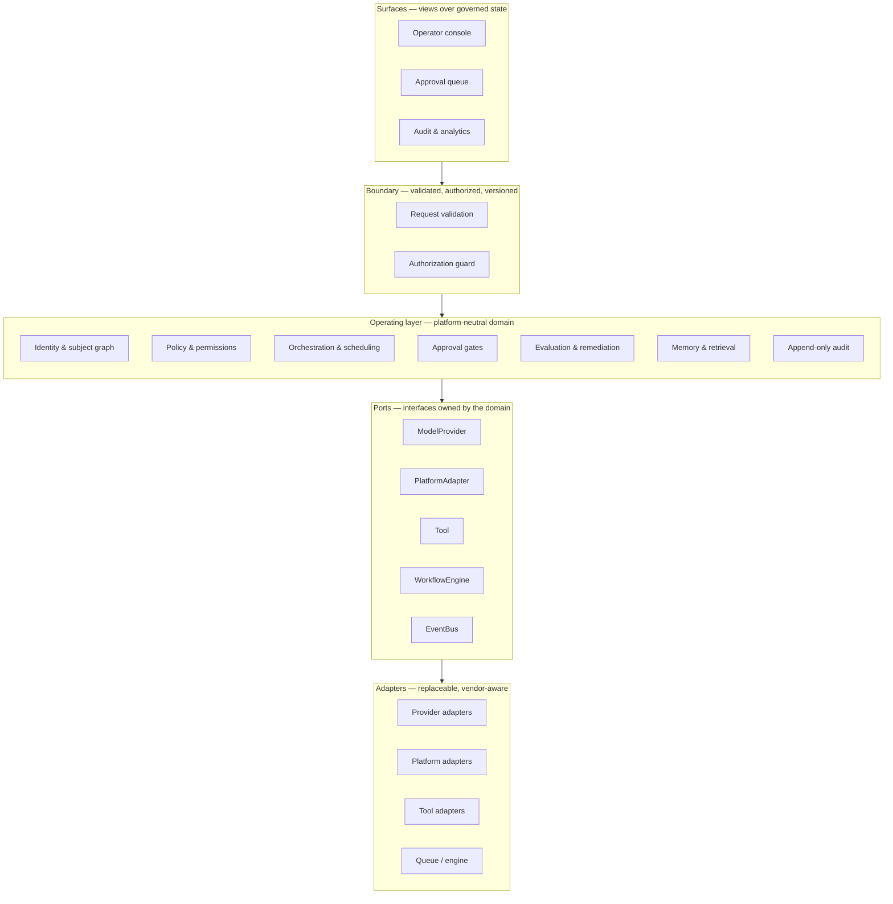
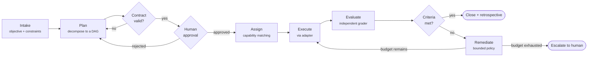
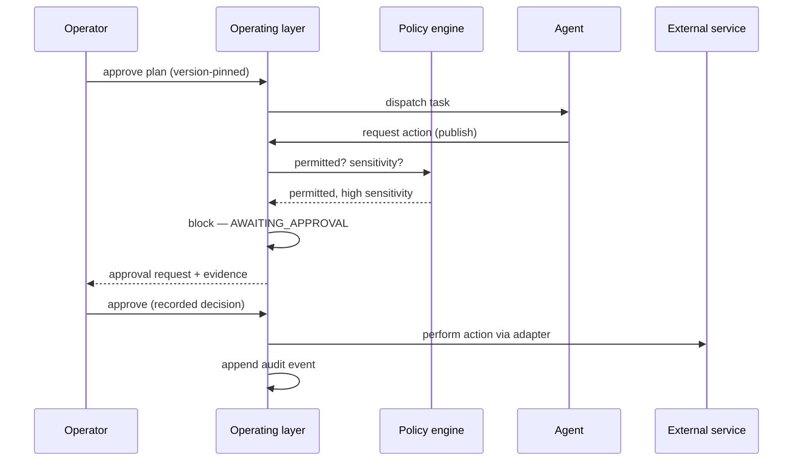
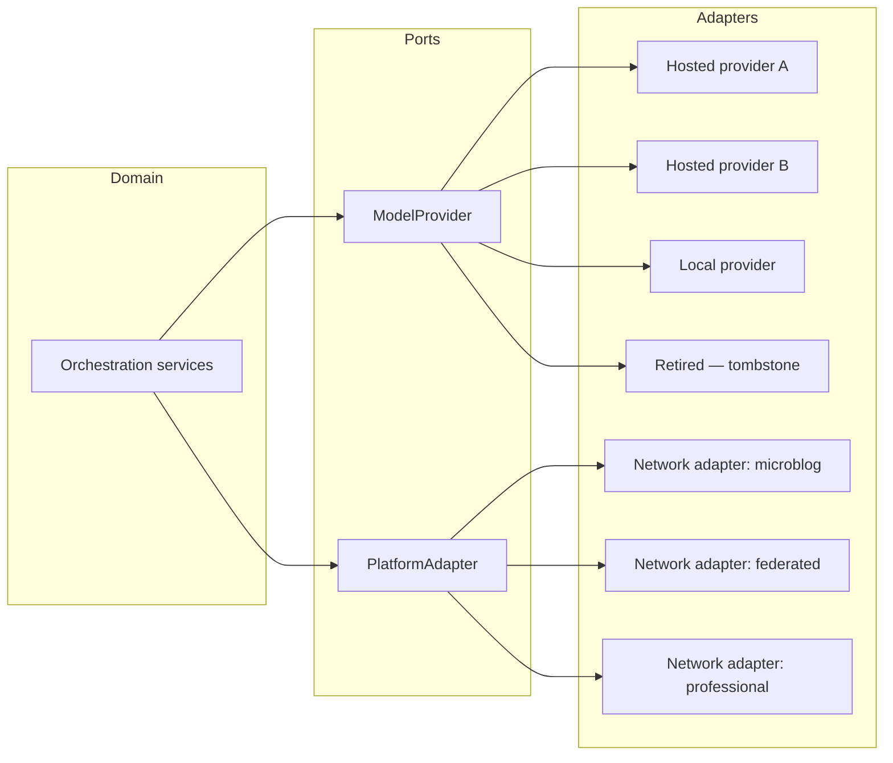

# Architecture

> Conceptual overview. This describes design intent and boundary placement. It is
> not an implementation specification, and it omits everything that would function
> as one.

---

## 1. The shape of the problem

An agentic system that touches external services has three failure modes that
matter more than model quality:

1. It does something irreversible that nobody approved.
2. It grades its own work and reports success.
3. It becomes worthless when a platform it was written against changes.

Model capability does not fix any of these. Architecture does. AgentiCubed is
organized around eliminating all three structurally, so that correctness does not
depend on a prompt being obeyed.

---

## 2. Layers

Four layers, dependencies pointing inward. The **operating layer** is the product;
everything else is either a view of it or a socket on its edge.

**The rule that keeps this honest:** the operating layer may import a *port*. It
may never import a vendor SDK, a queue client, or an HTTP request object. If a
domain service knows which model it is talking to, the boundary has been breached.

Ports are defined by the domain, in the domain's vocabulary. Adapters implement
them in the vendor's vocabulary and translate. That direction — domain defines,
edge conforms — is what makes vendors interchangeable rather than load-bearing.

---

## 3. The governed loop

### 3.1 Intake

An objective plus constraints. The design intent — not yet fully built — is that
intake shows the operator the system's *own restatement* of the objective before
anything is planned, so a misunderstanding is corrected while it is cheap rather
than discovered in the deliverable.

### 3.2 Plan as a contract

Planning emits a **versioned, strictly validated plan document**: tasks, their
dependencies, required capabilities, estimates, and per-task acceptance criteria.

Two properties do the work:

- **Strict validation.** Unknown fields are rejected, not ignored. A plan that
  does not conform is rejected at the boundary with a precise diagnostic naming
  the offending path — not silently coerced into something half-valid.
- **Acyclicity.** Dependencies form a DAG. Cycles are rejected at validation time,
  so the scheduler cannot deadlock on a plan it accepted.

This is the single most valuable boundary in the system. Everything downstream —
scheduling, assignment, evaluation, closeout — can assume a well-formed plan
because nothing else gets past this point.

### 3.3 Approval

The plan is presented to a human. Approve, reject with comment, or replan. The
decision is recorded against an identified person and a specific plan version;
approving version 3 does not approve version 4.

Approval is a **gate**, not a notification. Execution does not begin without it.

### 3.4 Assignment

Tasks declare required capabilities. Agents declare capabilities they hold with a
proficiency and supporting evidence. Matching is on capability, not on name — so
swapping the actor behind a capability changes nothing about the plan.

### 3.5 Execution

Dispatch goes through a `WorkflowEngine` port, so the queue technology is an
implementation detail. Each attempt writes an immutable execution record. A retry
does not overwrite its predecessor; it appends. The history of a task is the full
sequence of what was tried, not the last thing that happened.

Predecessor outputs are handed to successors as structured context, so a task
graph accumulates rather than restarting from the objective each time.

### 3.6 Evaluation

Two kinds, layered — one always runs, one is added when an evaluator is assigned:

- **Deterministic checks** *(always)* — verifiable properties of the artifact,
  graded against the task's declared acceptance criteria. No model is involved
  and the result cannot be argued with. This is the floor: every execution is
  evaluated, whether or not an evaluator agent exists.
- **Rubric evaluation by an independent agent** *(when one is assigned)* — a
  graded verdict from an actor that is *never* the executor. Separation is
  enforced at dispatch, when the evaluator is bound to the task, and re-validated
  when the evaluation is written.

When both run, the verdicts **combine** rather than one overriding the other, so
adding a model-based judge can only tighten the result — it can never rescue an
output the deterministic checks already failed.

Evaluator output is parsed **fail-closed**, and so is evaluator *availability*: a
verdict that cannot be parsed into the expected structure is a failure, and an
evaluator that errors or cannot be reached is a failure too. An unreachable judge
never becomes a silent pass.

### 3.7 Remediation

Failures are classified into structured gap descriptors, and a policy engine
selects a remediation action with a recorded justification: revise, reassign,
adjust configuration, decompose further, or escalate.

The loop is **bounded by an explicit budget**. When the budget is exhausted, the
work escalates to a human approval gate. A stuck agentic loop that quietly burns
tokens forever is a design failure; stopping and asking is the correct behaviour.

### 3.8 Closeout

A project closes only when its project-level acceptance criteria are satisfied.
Closure is gated, not declared.

---

## 4. Approval gates in detail

Two things are load-bearing:

1. **A standing permission is not an approval.** An agent may hold a valid,
   scoped, unexpired grant for an action and *still* be blocked, because the
   action is classified high-sensitivity or irreversible. Permission answers "is
   this actor allowed to do this kind of thing"; the gate answers "should this
   specific thing happen now".
2. **Rejection routes somewhere.** A rejected action goes to revision or replan.
   It never falls through to a silent proceed, and it never simply vanishes.

---

## 5. The adapter boundary

### 5.1 One adapter, many providers

Many model providers speak the same request and response shape. Rather than a
module per vendor, there is **one adapter parameterized by endpoint and credential
reference**. Adding a provider is a registry entry — configuration, not code.

This is not tidiness for its own sake. It means the cost of adding, replacing, or
dropping a provider is near zero, which is precisely the property you want when a
vendor makes a decision you did not vote on.

### 5.2 Retirement is a first-class state

When a provider is withdrawn, its adapter is **not deleted**. It is replaced by a
tombstone that:

- fails every call with a typed, bounded error carrying the correct status,
- exposes migration guidance naming the retirement date and the replacement,
- is excluded from the list of providers selectable for new work.

Deleting the adapter instead would make every stored record still referencing it
fail with an opaque "unknown provider" error at dispatch — turning a clear,
answerable condition into a mystery. The tombstone converts a dead dependency into
a readable instruction.

### 5.3 Errors are bounded by construction

Adapter failures surface as a small, closed set of categories — authentication,
authorization, not-found, timeout, rate-limited, invalid-request,
provider-unavailable, network-error — plus a status code. The provider's own
message never propagates, and the public error deliberately carries **no exception
chain**, because a chained exception can contain a URL, a header, or a credential
reference.

The counterweight, learned expensively: bounded does not mean *uninformative*. An
error that is safe but says nothing costs hours of misdiagnosis. Every failure
must name a cause that is both safe to show and sufficient to act on, and it must
reach the operator's screen rather than sitting in a database column. See
[`provenance.md`](provenance.md).

---

## 6. Identity and the subject graph *(design)*

Not built. Specified, and the reason the rest is built the way it is.

The premise: **an account is a projection, not an identity.** A durable subject is
the unit of memory, reputation, and policy; platform accounts attach to it as
edges. Concretely, that means:

- Observations from any network resolve to a subject, not a handle.
- Memory accrues to the subject and remains available when a platform is added,
  lost, or replaced.
- Policy is authored against subjects and capabilities, so it survives the network
  layer entirely.

The engineering consequence is that adapters must be *thin* — projection and
translation only. Any adapter that starts to own identity has become architecture,
and the whole property is lost.

---

## 7. Data shape

Described at the level of *what is recorded*, not how it is stored.

| Record | Property |
|--------|----------|
| Plan | Versioned, content-addressed, strictly validated |
| Task | Declares required capabilities and acceptance criteria |
| Dependency | Edge in a validated DAG |
| Execution attempt | **Append-only.** Retries append; nothing overwrites |
| Evaluation | Bound to an execution and to an evaluator that is not the executor |
| Approval | Decision, decider, timestamp, comment, pinned to a plan version |
| Permission grant | Actor, capability, scope, optional expiry |
| Audit event | Actor, action, redacted before/after, timestamp — **append-only** |

Append-only is enforced in the application *and independently at the storage
layer*. One enforcement point is a convention; two is an invariant.

---

## 8. What this architecture buys

| Failure mode | Structural defence |
|--------------|--------------------|
| Unapproved irreversible action | Approval gate on sensitivity and reversibility |
| Agent grades itself | Executor / evaluator separation, enforced at two points |
| Agent widens its own reach | Default-deny grants; self-escalation blocked at multiple layers and audited |
| Runaway retry loop | Bounded remediation budget, then human escalation |
| Secret leaks via prompt or log | Credential-by-reference, redaction, no exception chains in public errors |
| Vendor retires an API | Ports plus tombstones; replacement is configuration |
| History quietly rewritten | Append-only at application *and* storage layers |
| Malformed plan half-executes | Strict contract validation before approval is even offered |
| Deadlocked task graph | Cycle rejection at validation time |

---

## 9. What is deliberately unsolved

Stating these plainly is more useful than pretending otherwise:

- **Cross-platform identity resolution** is specified, not built. It is genuinely
  hard, and doing it badly is worse than not doing it.
- **Evaluation quality** is bounded by rubric quality. Structural separation
  prevents self-grading; it does not make a weak rubric strong.
- **Memory** currently accrues per project, not per subject.
- **Platform adapters** do not exist yet, on purpose. The substrate comes first.
- **Multi-tenancy** is scoped at the data layer but has not been proven at scale.

---

*Diagram sources: [`../assets/diagrams/`](../assets/diagrams/).*
