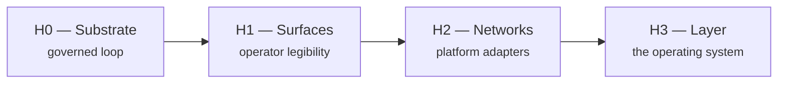

# Roadmap

> Directional, not a delivery commitment. Horizons are an **ordering**, not a
> schedule: H0 and H1 carry dates because they describe work that has happened or
> is happening; H2 and H3 carry none, because committing a date to unstarted work
> is exactly the overclaiming this document exists to avoid. Status labels are
> honest — "design" means specified and not built, and it will keep saying that
> until it is built.

---

## Sequencing principle

> Build the substrate before the surfaces, and the surfaces before the networks.

This is the opposite of the usual order, and it is a deliberate bet.

The tempting path is to ship a platform integration early — it demos well and it
looks like progress. It is also how you end up with an agent holding a real API
key inside a system that has no approval gate, no independent evaluation, and no
audit trail. That is not an MVP; it is an incident with a roadmap.

So: governance first, adapters last. Every horizon below assumes the one before it
is solid.

---

## H0 — Substrate *(largely complete as of 2026 H2)*

The governed loop, end to end, against live model providers.

| Item | Status |
|------|--------|
| Objective → validated plan → human approval → execution | **Working** |
| Strict, versioned plan contract with boundary validation | **Working** |
| Dependency-aware scheduling over a validated DAG | **Working** |
| Capability-based task assignment | **Working** |
| Independent evaluation with fail-closed verdict parsing | **Working** |
| Bounded remediation with escalation to a human | **Working** |
| Approval gates on irreversible and high-sensitivity actions | **Working** |
| Default-deny, scoped, expiring capability grants | **Working** |
| Append-only history, enforced at two layers | **Working** |
| Credential-by-reference with redaction | **Working** |
| Interchangeable model providers, retirement-tolerant | **Working** |
| Governance corpus — constitution, decision records, ontology, traceability | **Working**, Phase 0 accepted |
| Halt / resume control on a running project | **Working** |

**Remaining in H0:** hardening around live provider behaviour — rate-limit backoff,
preflight checks before a run starts, and failure presentation that names the
cause at the point of failure.

---

## H1 — Surfaces *(in progress, 2026 H2)*

Making the governed system legible to the person operating it. An audit trail
nobody can read is not accountability.

| Item | Status |
|------|--------|
| Operator console: projects, plans, approvals, live execution feed | **Working** |
| Failure diagnostics surfaced to the operator, not buried in storage | **Working** |
| Execution transcripts — the full reasoning and tool trace, retained | **In progress** |
| Queryable transcript viewer and timeline | **Design** |
| Intake refinement: system restates the objective for correction *before* planning | **Design** |
| Structured intake controls with live "what this changes" feedback | **Design** |
| Artifact browser in the console | **Design** |
| Deliverable quality: stronger prompts, self-revision, richer rubrics | **In progress** |

The intake work is the highest-leverage item here. Most bad agentic output is not
a model failure — it is a faithful execution of a misunderstood objective. Showing
the operator the system's own restatement, and letting them correct it before any
work is planned, moves the correction from the expensive end of the loop to the
cheap end.

---

## H2 — Networks *(design — no date committed)*

Only after the substrate can be trusted with a credential.

| Item | Status |
|------|--------|
| `PlatformAdapter` port — publish, read, observe, with per-surface constraints | **Design** |
| First adapters, **read-only** — observation before action | **Design** |
| Subject graph: durable identity with accounts as projections | **Design** |
| Cross-platform observation resolved to subjects, not handles | **Design** |
| Write path, gated: publication as an approval-gated action | **Design** |
| Per-surface constraint modelling — length, media, tone, rate | **Design** |

**Read before write** is a hard sequencing rule. A read-only adapter that is wrong
produces a bad report. A write adapter that is wrong produces a public post from
an account you own. These deserve very different levels of confidence, and the
read path is how that confidence gets earned.

---

## H3 — Layer *(design — no date committed)*

The operating system proper.

| Item | Status |
|------|--------|
| Durable cross-platform memory attached to subjects | **Design** |
| Policy authoring — declare once, enforce across every surface | **Design** |
| Cross-platform intelligence: signals correlated across networks | **Design** |
| Multi-tenant hosted offering | **Not started** |
| Delegated operation for teams with per-member scoping | **Not started** |

---

## Explicit non-goals

Stating these prevents a category of conversation that wastes everyone's time.

- **Not a scheduling tool.** Buffer and Hootsuite exist and are good at that.
  AgentiCubed is about governed agentic work, and scheduling is a consequence.
- **Not a model.** It is the layer that makes models usable in production without
  handing them the keys.
- **Not a growth-hacking or engagement-farming system.** The governance model is
  specifically designed to make ungoverned mass action difficult.
- **Not a platform ToS workaround.** Adapters conform to each platform's terms.
  A layer built on violations is a layer with a shutdown date.
- **Not fully autonomous.** Human approval on irreversible action is a permanent
  design property, not a training-wheels phase to be removed later.

---

## How this roadmap changes

Materially: by recorded decision. AgentiCubed maintains a governance corpus in
which architectural and directional changes are captured as decision records with
their rationale, alternatives considered, and consequences — including the
decisions that turned out to be wrong. See [`provenance.md`](provenance.md).

That machinery exists because a system that governs agentic work and cannot
account for its own changes has an obvious credibility problem.
