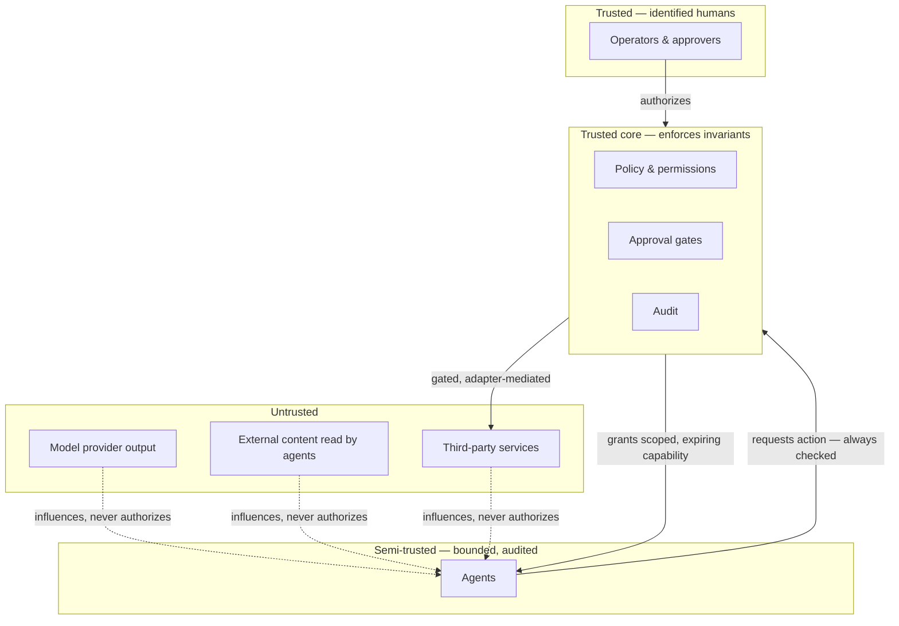

# Security boundaries

> **Scope note.** This document states *invariants and boundaries* — the
> properties the system is built to hold. It deliberately omits key management,
> deployment topology, network layout, authentication implementation, and control
> specifics. Those are operational details, and publishing them would help an
> attacker without helping a reader understand the design.
>
> This is not a security disclosure, an audit report, or a claim of
> comprehensiveness. It is a description of where the lines are drawn and why.

---

## 1. The premise

An agentic system's security problem is not primarily "can the model be tricked".
It is: **when the model is tricked, what is the blast radius?**

Prompt injection is a fact of life, not an eliminable defect. The design assumption
is therefore adversarial by default:

> Assume any agent may, at any moment, be attempting exactly the wrong thing —
> because the content it read told it to.

Every boundary below exists so that a fully hijacked agent still cannot exceed its
granted, audited, human-gated reach. Nothing depends on an instruction being
obeyed.

---

## 2. Trust boundaries

The single most important edge is the dotted one. External content — including
model output — can **influence** an agent's behaviour. It can never **authorize**
anything. Authorization flows only from an identified human, through policy, into
a scoped grant.

---

## 3. Invariants

These are the properties the system is built to hold. Each is enforced
structurally, not by convention.

### I1 — Secrets are referenced, never stored

Credentials are held as *references*. The value is resolved at the moment of an
outbound call and discarded. It is never written to a prompt, a log line, a task
input, a task output, an artifact, or an audit record. Configuration templates
carry placeholders only; real credential files are never committed.

### I2 — Errors leak nothing

Errors crossing a boundary carry a bounded category and a status code. Provider
messages do not propagate. Public errors carry **no exception chain**, because a
chained exception can retain a URL, a header, or a credential reference — a subtle
enough leak that it is verified by dedicated tests rather than trusted to review.

### I3 — Permissions are default-deny, scoped, and expiring

An agent may use a capability only when an explicit grant exists for that exact
pairing. Absence is denial. Grants carry a scope and may carry an expiry, and the
scope is enforced at the moment of invocation — not only at grant time.

### I4 — Agents cannot escalate themselves

Enforced at multiple independent layers: the authorization guard rejects an agent
as the actor for permission changes; the service layer refuses self-directed
grants; and every attempt is written to the audit log as a security event whether
or not it succeeded. Agents also cannot alter their own configuration or role, and
cannot disable an evaluator.

### I5 — Irreversible actions require a human decision

Any action classified irreversible or high-sensitivity — sends, deletes, payments,
publications, sign-offs — blocks pending a recorded decision by an identified
approver. A standing permission does not substitute for the gate. Rejection routes
to revision or replan; it never falls through to a silent proceed.

### I6 — Self-grading is structurally impossible

The evaluator of a result is never the actor that produced it. Enforced when work
is dispatched *and* re-validated when the evaluation is persisted. Two enforcement
points, because one is a convention and two is an invariant.

### I7 — History is append-only

Execution records, evaluations, and audit events cannot be updated or deleted from
the application, and the storage layer enforces the same rule independently. A
retry appends a new attempt; it does not overwrite its predecessor. Compromising
the application does not silently rewrite the record.

### I8 — Tenancy is enforced where queries are issued

Isolation is applied at the data-access layer, so cross-tenant access is refused
before a query runs rather than depending on every call site remembering a filter.
There is no application-level global bypass.

### I9 — Input is validated at the boundary, strictly

Everything crossing the boundary is validated against an explicit schema with
unknown fields rejected rather than ignored. Queries are parameterized. A
malformed plan is refused with a precise diagnostic instead of being coerced into
something half-valid.

### I10 — Failures are visible

An error that is safe but uninformative is its own security problem: it drives
operators toward guessing, and guessing produces unsafe workarounds. Every failure
must carry a cause that is both safe to publish and sufficient to act on, and it
must actually reach the person operating the system. This invariant was added
after a redacted-but-empty error cost days of misdiagnosis.

---

## 4. Threats and structural responses

| Threat | Response |
|--------|----------|
| Prompt injection redirects an agent | Default-deny scoped grants (I3) + approval gates (I5): a hijacked agent still cannot exceed its audited reach |
| Agent grades its own output | Executor / evaluator separation at two enforcement points (I6) |
| Agent widens its own permissions | Multi-layer self-escalation block, audited on attempt (I4) |
| Credential leaks via prompt, log, or error | Reference-only credentials, redaction, no exception chains (I1, I2) |
| Irreversible action taken autonomously | Sensitivity classification and blocking gate (I5) |
| Cross-tenant data access | Enforcement at the data-access layer (I8) |
| History tampering to hide a failure | Append-only at application *and* storage layers (I7) |
| Runaway loop consuming budget indefinitely | Bounded remediation policy, then human escalation |
| Malformed plan executes partially | Strict contract validation before approval is offered (I9) |
| Deadlocked task graph | Cycle rejection at plan validation |
| Vendor withdraws an API | Ports and tombstones; replacement is configuration |
| Operator blocked by an opaque failure | Diagnostic sufficiency as an explicit invariant (I10) |

---

## 5. Privacy posture

- **Data minimization.** The system records what is needed to govern and audit
  work. Governance is not a licence to collect.
- **Provider awareness.** Free tiers of some model providers may use submitted
  content to improve their models. That is a *deployment* decision with real
  consequences, so provider selection is explicit and per-agent, and a local
  provider is a supported option for work that must not leave the machine.
- **Subject-scoped memory** *(design)*. Memory attaches to a durable subject, which
  makes deletion and export tractable — you can enumerate what is held about a
  subject. Fragmenting the same data across per-platform silos makes both
  impossible.
- **Audit as accountability, not surveillance.** Audit records capture decisions
  and state transitions with redacted before/after values. They are not a content
  archive.

---

## 6. What this document does not tell you

Intentionally absent, and it will stay absent:

- Key storage, rotation, and management
- Authentication and session implementation
- Deployment topology, hosts, and network boundaries
- Rate limits, quotas, and thresholds
- Specific enforcement code paths
- Dependency and version inventory
- Incident response procedure

A conceptual showcase should let a reader evaluate the *design*. It should not
function as a map for someone attacking a running instance.

---

## 7. Reporting

This repository contains no running system and no source code. If you find an
error in this documentation, open an issue. Do not use public issues to report a
suspected vulnerability in any AgentiCubed service; contact the maintainer
directly.
